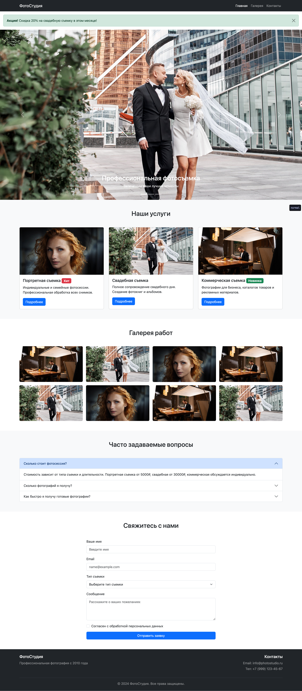

# Работа с Bootstrap

## Срок сдачи работ

Последний коммит и пул реквест должен быть оформлен до ???

## Цель:

Разработать следующий сайт с использованием Bootstrap



## Инструкция

## Шаг 1: Установка Bootstrap через npm

### 1.1 Инициализация проекта

```bash
npm init -y
```

### 1.2 Установка Bootstrap

```bash
npm install bootstrap@5.3.2
```

### 1.3 Создание структуры проекта

Создайте следующие папки и файлы:

```
uidev-lab21-{фамилия}/
├── css/
├── js/
├── images/
└── index.html
```

### 1.4 Копирование файлов Bootstrap

Скопируйте необходимые файлы из node_modules:

```bash
cp node_modules/bootstrap/dist/css/bootstrap.min.css css/
cp node_modules/bootstrap/dist/js/bootstrap.bundle.min.js js/
```

---

## Шаг 2: Создание базовой структуры HTML

Откройте `index.html` и добавьте базовую разметку:

```html
<!DOCTYPE html>
<html lang="ru">
    <head>
        <meta charset="UTF-8" />
        <meta name="viewport" content="width=device-width, initial-scale=1.0" />
        <title>Портфолио фотографа</title>
        <!-- Подключение Bootstrap CSS -->
        <link rel="stylesheet" href="css/bootstrap.min.css" />
    </head>
    <body>
        <!-- Здесь будет контент -->

        <!-- Подключение Bootstrap JS -->
        <script src="js/bootstrap.bundle.min.js"></script>
    </body>
</html>
```

---

## Шаг 3: Создание навигации (Navbar)

Добавьте навигационное меню после открывающего тега `<body>`:

```html
<nav class="navbar navbar-expand-lg navbar-dark bg-dark sticky-top">
    <div class="container">
        <a class="navbar-brand" href="#">ФотоСтудия</a>
        <button
            class="navbar-toggler"
            type="button"
            data-bs-toggle="collapse"
            data-bs-target="#navbarNav">
            <span class="navbar-toggler-icon"></span>
        </button>
        <div class="collapse navbar-collapse" id="navbarNav">
            <ul class="navbar-nav ms-auto">
                <li class="nav-item">
                    <a class="nav-link active" href="#home">Главная</a>
                </li>
                <li class="nav-item">
                    <a class="nav-link" href="#gallery">Галерея</a>
                </li>
                <li class="nav-item">
                    <a class="nav-link" href="#contact">Контакты</a>
                </li>
            </ul>
        </div>
    </div>
</nav>
```

**Используемые классы Bootstrap:**

- **[Navbar](https://getbootstrap.com/docs/5.3/components/navbar/)** - компонент навигации
- `navbar-expand-lg` - навигация раскрывается на экранах ≥992px
- `navbar-dark` и `bg-dark` - темная цветовая схема
- `sticky-top` - фиксирует навигацию при прокрутке
- **[Container](https://getbootstrap.com/docs/5.3/layout/containers/)** - центрирует и ограничивает ширину контента
- `ms-auto` - margin-start: auto (прижимает меню вправо)

---

## Шаг 4: Создание Hero-секции с Carousel

Добавьте карусель с изображениями:

```html
<section id="home">
    <div id="heroCarousel" class="carousel slide" data-bs-ride="carousel">
        <div class="carousel-indicators">
            <button
                type="button"
                data-bs-target="#heroCarousel"
                data-bs-slide-to="0"
                class="active"></button>
            <button
                type="button"
                data-bs-target="#heroCarousel"
                data-bs-slide-to="1"></button>
            <button
                type="button"
                data-bs-target="#heroCarousel"
                data-bs-slide-to="2"></button>
        </div>
        <div class="carousel-inner">
            <div class="carousel-item active">
                
                <div class="carousel-caption d-none d-md-block">
                    <h2>Профессиональная фотосъемка</h2>
                    <p>Запечатлим ваши лучшие моменты</p>
                </div>
            </div>
            <div class="carousel-item">
                
                <div class="carousel-caption d-none d-md-block">
                    <h2>Студийная съемка</h2>
                    <p>Современное оборудование и уютная атмосфера</p>
                </div>
            </div>
            <div class="carousel-item">
                
                <div class="carousel-caption d-none d-md-block">
                    <h2>Выездные фотосессии</h2>
                    <p>На природе, в городе, где угодно</p>
                </div>
            </div>
        </div>
        <button
            class="carousel-control-prev"
            type="button"
            data-bs-target="#heroCarousel"
            data-bs-slide="prev">
            <span class="carousel-control-prev-icon"></span>
        </button>
        <button
            class="carousel-control-next"
            type="button"
            data-bs-target="#heroCarousel"
            data-bs-slide="next">
            <span class="carousel-control-next-icon"></span>
        </button>
    </div>
</section>
```

**Используемые компоненты:**

- **[Carousel](https://getbootstrap.com/docs/5.3/components/carousel/)** - компонент карусели
- `data-bs-ride="carousel"` - автоматическая прокрутка
- `d-none d-md-block` - скрывает подписи на малых экранах, показывает на средних и выше

---

## Шаг 5: Создание секции "О нас" с Cards

```html
<section class="py-5 bg-light">
    <div class="container">
        <h2 class="text-center mb-5">Наши услуги</h2>
        <div class="row g-4">
            <div class="col-md-4">
                <div class="card h-100">
                    
                    <div class="card-body">
                        <h5 class="card-title">Портретная съемка</h5>
                        <p class="card-text">
                            Индивидуальные и семейные фотосессии.
                            Профессиональная обработка всех снимков.
                        </p>
                        <a href="#" class="btn btn-primary">Подробнее</a>
                    </div>
                </div>
            </div>
            <div class="col-md-4">
                <div class="card h-100">
                    
                    <div class="card-body">
                        <h5 class="card-title">Свадебная съемка</h5>
                        <p class="card-text">
                            Полное сопровождение свадебного дня. Создание
                            фотокниг и альбомов.
                        </p>
                        <a href="#" class="btn btn-primary">Подробнее</a>
                    </div>
                </div>
            </div>
            <div class="col-md-4">
                <div class="card h-100">
                    
                    <div class="card-body">
                        <h5 class="card-title">Коммерческая съемка</h5>
                        <p class="card-text">
                            Фотографии для бизнеса, каталогов товаров и
                            рекламных материалов.
                        </p>
                        <a href="#" class="btn btn-primary">Подробнее</a>
                    </div>
                </div>
            </div>
        </div>
    </div>
</section>
```

**Используемые компоненты и классы:**

- **[Cards](https://getbootstrap.com/docs/5.3/components/card/)** - карточки с контентом
- **[Grid System](https://getbootstrap.com/docs/5.3/layout/grid/)** - система сеток
- `col-md-4` - три колонки на средних экранах и выше (12/3=4)
- `g-4` - gap (отступы между колонками)
- `h-100` - высота 100% (выравнивает карточки по высоте)
- **[Spacing](https://getbootstrap.com/docs/5.3/utilities/spacing/)**: `py-5` (padding по Y-оси), `mb-5` (margin-bottom)
- **[Buttons](https://getbootstrap.com/docs/5.3/components/buttons/)**: `btn btn-primary`

---

## Шаг 6: Создание галереи с Modal

```html
<section id="gallery" class="py-5">
    <div class="container">
        <h2 class="text-center mb-5">Галерея работ</h2>
        <div class="row g-3">
            <div class="col-lg-3 col-md-4 col-sm-6">
                
            </div>
            <div class="col-lg-3 col-md-4 col-sm-6">
                
            </div>
            <div class="col-lg-3 col-md-4 col-sm-6">
                
            </div>
            <div class="col-lg-3 col-md-4 col-sm-6">
                
            </div>
            <div class="col-lg-3 col-md-4 col-sm-6">
                
            </div>
            <div class="col-lg-3 col-md-4 col-sm-6">
                
            </div>
            <div class="col-lg-3 col-md-4 col-sm-6">
                
            </div>
            <div class="col-lg-3 col-md-4 col-sm-6">
                
            </div>
        </div>
    </div>
</section>

<div class="modal fade" id="imageModal1" tabindex="-1">
    <div class="modal-dialog modal-lg modal-dialog-centered">
        <div class="modal-content">
            <div class="modal-header">
                <h5 class="modal-title">Портретная съемка</h5>
                <button
                    type="button"
                    class="btn-close"
                    data-bs-dismiss="modal"></button>
            </div>
            <div class="modal-body">
                
            </div>
        </div>
    </div>
</div>
```

**Используемые компоненты:**

- **[Images](https://getbootstrap.com/docs/5.3/content/images/)**: `img-fluid` (адаптивные изображения), `rounded` (скругленные углы)
- **[Modal](https://getbootstrap.com/docs/5.3/components/modal/)** - модальные окна
- `data-bs-toggle="modal"` и `data-bs-target` - атрибуты для открытия модального окна
- Адаптивные колонки: `col-lg-3` (4 колонки), `col-md-4` (3 колонки), `col-sm-6` (2 колонки)

---

## Шаг 7: Форма обратной связи

```html
<section id="contact" class="py-5 bg-light">
    <div class="container">
        <h2 class="text-center mb-5">Свяжитесь с нами</h2>
        <div class="row justify-content-center">
            <div class="col-lg-6">
                <form>
                    <div class="mb-3">
                        <label for="name" class="form-label">Ваше имя</label>
                        <input
                            type="text"
                            class="form-control"
                            id="name"
                            placeholder="Введите имя"
                            required />
                    </div>
                    <div class="mb-3">
                        <label for="email" class="form-label">Email</label>
                        <input
                            type="email"
                            class="form-control"
                            id="email"
                            placeholder="name@example.com"
                            required />
                    </div>
                    <div class="mb-3">
                        <label for="service" class="form-label">
                            Тип съемки
                        </label>
                        <select class="form-select" id="service">
                            <option selected>Выберите тип съемки</option>
                            <option value="1">Портретная</option>
                            <option value="2">Свадебная</option>
                            <option value="3">Коммерческая</option>
                        </select>
                    </div>
                    <div class="mb-3">
                        <label for="message" class="form-label">
                            Сообщение
                        </label>
                        <textarea
                            class="form-control"
                            id="message"
                            rows="4"
                            placeholder="Расскажите о ваших пожеланиях"></textarea>
                    </div>
                    <div class="mb-3 form-check">
                        <input
                            type="checkbox"
                            class="form-check-input"
                            id="agree" />
                        <label class="form-check-label" for="agree">
                            Согласен с обработкой персональных данных
                        </label>
                    </div>
                    <button type="submit" class="btn btn-primary w-100">
                        Отправить заявку
                    </button>
                </form>
            </div>
        </div>
    </div>
</section>
```

**Используемые компоненты:**

- **[Forms](https://getbootstrap.com/docs/5.3/forms/overview/)** - формы
- `form-control` - стилизация полей ввода
- `form-select` - стилизация выпадающего списка
- `form-check` - стилизация чекбоксов
- `form-label` - стилизация labels
- `w-100` - ширина 100%
- `justify-content-center` - центрирование колонок по горизонтали

---

## Шаг 8: Footer с использованием утилит

```html
<footer class="bg-dark text-white py-4">
    <div class="container">
        <div class="row">
            <div class="col-md-6">
                <h5>ФотоСтудия</h5>
                <p class="text-white-50">
                    Профессиональная фотография с 2010 года
                </p>
            </div>
            <div class="col-md-6 text-md-end">
                <h5>Контакты</h5>
                <p class="text-white-50 mb-1">Email: info@photostudio.ru</p>
                <p class="text-white-50">Тел: +7 (999) 123-45-67</p>
            </div>
        </div>
        <hr class="border-secondary" />
        <p class="text-center text-white-50 mb-0">
            &copy; 2024 ФотоСтудия. Все права защищены.
        </p>
    </div>
</footer>
```

**Используемые утилиты:**

- **[Colors](https://getbootstrap.com/docs/5.3/utilities/colors/)**: `bg-dark`, `text-white`, `text-white-50`
- **[Text alignment](https://getbootstrap.com/docs/5.3/utilities/text/#text-alignment)**: `text-center`, `text-md-end` (выравнивание справа на md+)
- **[Borders](https://getbootstrap.com/docs/5.3/utilities/borders/)**: `border-secondary`

---

## Самостоятельные задания

### Задание 1: Добавьте компонент Accordion

Создайте секцию FAQ с использованием [Accordion](https://getbootstrap.com/docs/5.3/components/accordion/)

### Задание 2: Добавьте Badges и Progress

Добавьте в карточки услуг [Badges](https://getbootstrap.com/docs/5.3/components/badge/) (например, "Хит") и [Progress bars](https://getbootstrap.com/docs/5.3/components/progress/) для индикации загруженности

### Задание 3: Кастомизация цветов

Создайте файл `custom.css` и переопределите основные цвета Bootstrap через CSS-переменные

### Задание 4: Добавьте Alert

Например про скидку

---

## Документация

- **[Официальная документация Bootstrap 5.3](https://getbootstrap.com/docs/5.3/getting-started/introduction/)**
- **[Grid System](https://getbootstrap.com/docs/5.3/layout/grid/)**
- **[Breakpoints](https://getbootstrap.com/docs/5.3/layout/breakpoints/)**
- **[Spacing utilities](https://getbootstrap.com/docs/5.3/utilities/spacing/)**
- **[Все компоненты](https://getbootstrap.com/docs/5.3/components/)**

---

## Как сдавать

1. Создайте форк репозитория в организации `31ISP` с названием `uidev-lab20-вашафамилия`
2. Используя ветку `wip` сделайте задание
3. Зафиксируйте изменения в вашем репозитории
4. Когда документ будет готов - создайте пул реквест из ветки `wip` (вашей) на ветку `main` (тоже вашу) и укажите меня ([ktkv419](https://github.com/ktkv419)) как reviewer

**Не мержите сами коммит**, это сделаю я после проверки задания
